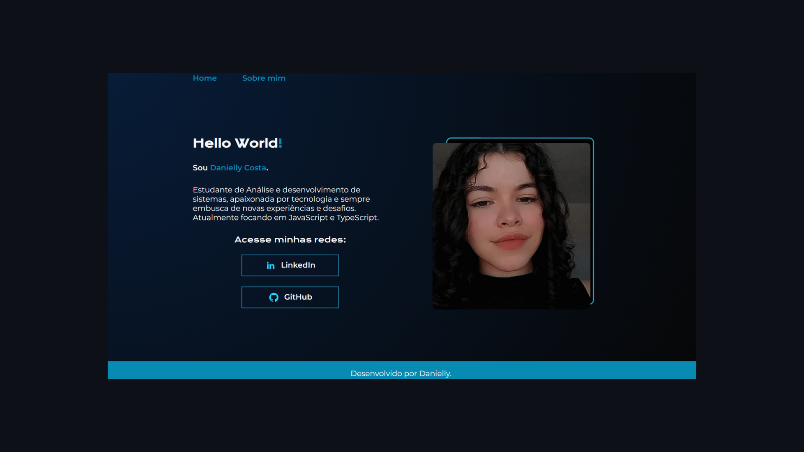

# Site pessoal 
 
Olá! Bem-vindo ao meu projeto de um site pessoal, criado com base no curso de HTML e CSS da trilha inicial do programa ONE, parceria da Oracle + Alura. O seu principal objetivo, é consolidar conceitos de HTML e CSS, além de apresentar uma breve descrição sobre mim e minha jornada na tecnologia até aqui.

## Ferramentas utilizadas:

* HTML
* CSS

## Créditos

Projeto criado com base no curso de HTML e CSS da Alura + Oracle.